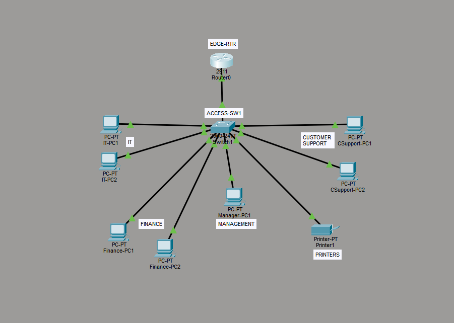

# Enterprise Network Segmentation using VLANs and Router-on-a-Stick

## Project Overview

This project demonstrates the design and implementation of a small enterprise network using VLAN segmentation and Router-on-a-Stick (ROAS) in Cisco Packet Tracer.

The network simulates a small company where different departments are logically separated into individual VLANs to improve security, reduce broadcast traffic, and simplify network management. Inter-VLAN communication is provided through Router-on-a-Stick using IEEE 802.1Q trunking.

The project was developed as part of my networking portfolio to strengthen my understanding of enterprise networking concepts through hands-on implementation rather than configuration memorization.

---

## Objectives

- Design a small enterprise network based on organizational departments.
- Implement VLAN segmentation using a Layer 2 switch.
- Configure IEEE 802.1Q trunking between the switch and router.
- Implement Router-on-a-Stick (ROAS) for inter-VLAN routing.
- Configure static IPv4 addressing for all hosts.
- Verify network connectivity using Cisco IOS verification commands and ICMP testing.
- Apply basic switch hardening by changing the native VLAN from VLAN 1.

---

## Network Topology



```
                                                    EDGE-RTR
                                            (Router-on-a-Stick)
                                                    │
                                                802.1Q Trunk
                                                    │
                                                ACCESS-SW1
                                ┌─────────┬─────────┬─────────┬─────────────┐
                                │         │         │         │             │         
                                IT      Finance   Customer   Management   Printers
                                VLAN10    VLAN20     VLAN30      VLAN40      VLAN50
```

---

## VLAN and IP Addressing Plan

| VLAN |    Department    |     Network     | Default Gateway |
|------|------------------|-----------------|-----------------|
|  10  |        IT        | 192.168.10.0/24 |   192.168.10.1  |
|  20  |      Finance     | 192.168.20.0/24 |   192.168.20.1  |
|  30  | Customer Support | 192.168.30.0/24 |   192.168.30.1  |
|  40  |    Management    | 192.168.40.0/24 |   192.168.40.1  |
|  50  |     Printers     | 192.168.50.0/24 |   192.168.50.1  |
|  999 | Native / Unused  |       N/A       |       N/A       |

---

## Technologies Used

- Cisco Packet Tracer
- Cisco IOS CLI
- VLANs
- IEEE 802.1Q Trunking
- Router-on-a-Stick (ROAS)
- Static IPv4 Addressing
- Layer 2 Switching
- Layer 3 Routing

---

## Skills Demonstrated

- Enterprise Network Design
- VLAN Configuration
- Router-on-a-Stick Deployment
- Inter-VLAN Routing
- IEEE 802.1Q Trunk Configuration
- Static IP Addressing
- Cisco IOS CLI
- Network Verification
- Basic Network Troubleshooting
- ARP Analysis
- Network Documentation

---

## Verification

The following Cisco IOS commands were used to verify the network configuration:

```bash
show vlan brief
show interfaces trunk
show ip interface brief
show ip route
```

Connectivity was validated by performing ICMP ping tests between hosts located in different VLANs.

---

## Repository Structure

```
enterprise-vlan-network/
│
├── README.md
├── topology/
├── configs/
├── documentation/
└── screenshots/
```

- **topology/** – Cisco Packet Tracer project and network diagram.
- **configs/** – Running configurations of the switch and router.
- **documentation/** – Design decisions, implementation process, troubleshooting notes, and lessons learned.
- **screenshots/** – Verification outputs and network topology images.

---

## Key Concepts Demonstrated

- VLAN Segmentation
- Broadcast Domain Isolation
- Access Ports
- Trunk Ports
- IEEE 802.1Q VLAN Tagging
- Router-on-a-Stick
- Inter-VLAN Routing
- Default Gateway Operation
- Address Resolution Protocol (ARP)
- Static Routing Between Directly Connected Networks
- Basic Switch Hardening

---

## Results

The completed network successfully provides communication between multiple departmental VLANs using Router-on-a-Stick.

Verification confirmed:

- VLANs were created successfully.
- Access ports were assigned correctly.
- Trunk links carried multiple VLANs using IEEE 802.1Q.
- Router subinterfaces functioned as default gateways.
- Inter-VLAN communication was successful.
- Initial ICMP delay due to ARP resolution was observed and analyzed.

---

## Lessons Learned

This project reinforced several fundamental networking concepts beyond simply configuring Cisco devices.

Key takeaways include:

- Understanding why organizations implement VLAN segmentation.
- Differentiating the responsibilities of Layer 2 switches and Layer 3 routers.
- Understanding how IEEE 802.1Q tagging enables multiple VLANs to share a single physical connection.
- Learning that routers first identify the incoming VLAN through the 802.1Q tag before routing packets based on the destination IP address.
- Recognizing ARP resolution as the cause of the initial ICMP timeout during connectivity testing.
- Developing a troubleshooting approach based on packet flow instead of memorizing CLI commands.

---

## Future Improvements

Future versions of this project will expand the network by implementing:

- DHCP Services
- Access Control Lists (ACLs)
- SSH Remote Management
- Dynamic Routing (OSPF)
- Network Address Translation (NAT)
- Internet Connectivity
- Windows Server and Active Directory
- Linux-based Network Services
- Network Automation using Bash and Python